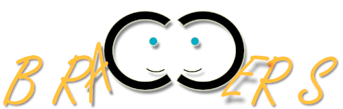

# Braggers

**Helps the best ideas happen faster!**

One Project For The First Edition Of Axway's Node.js Training

# Brief Description

Platform for doing hands-on trainings. It will facilitate any training endeavors and will be used for collaboration between students. The platform will allow tracking/showcasing projects developed during such trainings. The broader vision is that the platform will allow third parties like Universities, Investment and Other Companies to see and select best ideas/projects that they want to directly support/fund/use in one way or another. So the platform will close the gap between Students, Universities, and Businesses.

# Backlog

- [ ] Users Management - CRUD Users

- [ ] Trainings Management  - CRUD Trainings

- [ ] Projects Management  - CRUD Projects

- [ ] User Types - each user must have type like Student / University or Business representative

- [ ] Discussion Forum

More to come...

 
